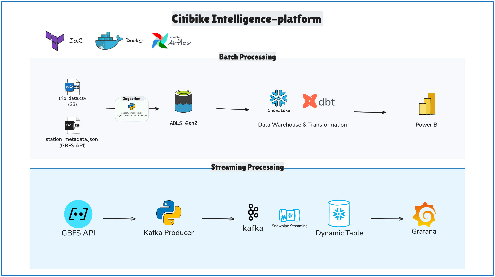

# Citibike Analytics Pipeline

> ⚠️ Work in Progress - This project is under active development and not yet complete.

A real-time + historical analytics system that helps Citibike operations team make data-driven decisions.


## Architecture

```
┌─────────────────────────────────────────────────────────────────┐
│  DELIVERABLE COMPONENTS                                         │
└─────────────────────────────────────────────────────────────────┘

1. Real-Time Dashboard (Looker Studio)
   └─ Shows live + historical bike usage

2. ML Prediction Engine (Databricks)
   └─ Forecasts demand, alerts for rebalancing

3. Automated Data Pipeline (Airflow + Kafka)
   └─ Ingests batch + stream data automatically

4. Data Warehouse (Snowflake)
   └─ Combined historical + real-time data

5. Infrastructure as Code (Terraform)
   └─ Entire system reproducible in 1 command
```
### Data Flow for the Batch data:


## Business Problems Solved

| **Problem**                             | **Solution**                                                                | **How It Works**                                                                                                                                        | **Business Value**                                                                           |
| --------------------------------------- | --------------------------------------------------------------------------- | ------------------------------------------------------------------------------------------------------------------------------------------------------- | -------------------------------------------------------------------------------------------- |
| **Bike Shortages During Rush Hour**     | ML predicts shortages; alerts ops team; rebalancing trucks sent proactively | - Streaming: Current bikes via GBFS API<br>- Historical: Rush-hour patterns (CSV)<br>- ML: Predict depletion<br>- Alerts: 30 min prior                  | - Fewer lost rentals<br>- Higher revenue<br>- Better customer experience                     |
| **Bike Surplus at Low-Demand Stations** | Recommend moving surplus bikes to high-demand stations                      | - Streaming: Bikes/docks availability<br>- Historical: Low-demand station patterns<br>- ML: Predict low rentals<br>- Recommendation engine              | - Better bike utilization<br>- Reduced idle inventory<br>- More dock availability            |
| **Inefficient Rebalancing Routes**      | Dynamic optimized routes for drivers                                        | - Streaming: Real-time station availability<br>- Historical: Demand patterns<br>- ML: Predict 2-hr demand<br>- Optimization: TSP algorithm              | - Reduce labor hours<br>- Move more bikes/hour<br>- Prevent shortages faster                 |
| **Seasonal Capacity Planning**          | Forecast seasonal demand; plan bike fleet & procurement                     | - Historical: 10 years CSV data<br>- ML: Time series forecasting (Prophet, ARIMA)<br>- External: Weather/events                                         | - Right-size fleet<br>- Reduce capital costs<br>- Maximize bike utilization                  |
| **Member vs Casual User Experience**    | Personalized mobile recommendations                                         | - Streaming: Current availability (GBFS)<br>- Historical: User behavior patterns<br>- ML: Predict casual vs member patterns<br>- Personalization engine | - Increase conversions (casual → member)<br>- Improve satisfaction<br>- Reduce support calls |


>  [See the problems in detail.](docs/Problems.md)

## Tech Stack

**Data Ingestion**: Apache Kafka, GBFS API, batch CSV
**Data Processing**: Databricks Spark, dbt
**Data Orchestration**: Apache Airflow
**Data Warehouse**: Snowflake
**Visualization**: Looker Studio (Real-time + Historical)
**IaC**: Terraform
**Machine Learning**: Python, XGBoost, Prophet, TensorFlow, scikit-learn
**External Data**: Weather API, Events Calendar

## Dataset

- **Source**: [Citibike System Data](https://citibikenyc.com/system-data)
- **Scope**: 2013-2024 (24 months)
- **Size**: ~50M trips, ~4GB
- **Format**: CSV

## Project Structure
```
citibike-analytics-pipeline/ 
├── airflow/ 
├── dbt/
├── terraform/ 
├── notebooks/ 
├── dashboard/ 
├── ml/ 
├── docs/ 
└── README.md

```

## Dashboard Overview
### Tab 1: Real-Time Operations 🔴

Live station map (color-coded by bike availability)

ML-powered alerts for shortages/surpluses

Active trips and system status overview

### Tab 2: Historical Analytics 📈

Key metrics: trips, average time, members, stations

Hourly usage heatmap

Top 10 stations & daily trends

### Tab 3: ML Insights 🤖

Next 24-hour demand forecast

Rebalancing recommendations

Station clustering visualization

Model performance metrics

### Tab 4: Business Intelligence 💼

Revenue breakdown (member vs casual)

Churn risk alerts

Weather impact prediction

Growth opportunities & recommendations

## Setup


License

MIT License - see LICENSE
Data Attribution

Citibike System Data provided by Lyft Bikes and Scooters, LLC.
Available at: https://citibikenyc.com/system-data
Author

GitHub: 
LinkedIn: 

Built for DataTalks.Club Data Engineering Zoomcamp