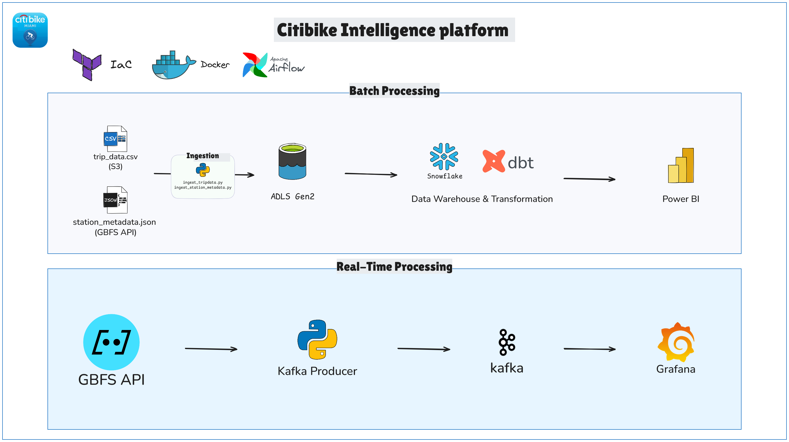
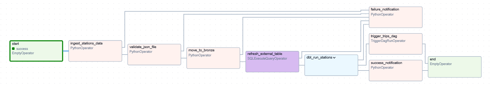
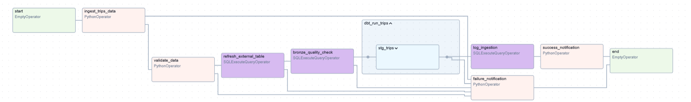
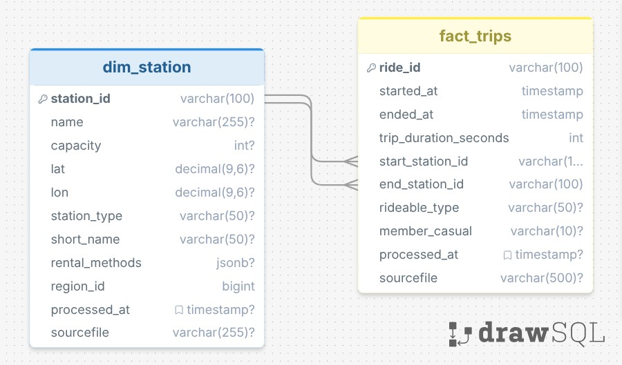

# Citibike Intelligence Platform

> ⚠️ Work in Progress - This project is under active development and not yet complete.
## Project Overview

## Data Engineering Phase

### Terraform (Infrastructure as Code)
Using IaC to create the following resources:
#### 🔵 Azure
- Resource Group
- ADLS Gen2 Storage Account
- Container (bronze)
#### ❄️ Snowflake
- Warehouse (CITIBIKE_DWH)
- Database (CITIBIKE_DB)
- Schemas (EXTERNAL, SILVER, GOLD)
- 2 File Formats (CSV, JSON)
- An External Stage (BRONZE_STAGE)
- Storage Integration

### Data Sources
1. **Batch** Processed Data
    - Trip Data
    - Station Metadata
2. **Real-Time** Data
    - Station Status (GBFS API)
<!-- 3. External Data
    - **Weather** Data
    - Calendar / Events -->

### Airflow
Two DAGs:
- citibike_monthly_stations_ingestion
    
- citibike_trips_ingestion

## Analytics Engineering Phase
Using dbt
### Data Modeling & Warehouse

- Trips Data -> fact_trips
- Station Metadata -> dim_station
### Data Quality
Stage-gate approach: external → validate → staging → validate → marts

## Streaming Data Pipeline
Source - Station Status (GBFS API) -> Python Producer -> Kafka Topic -> [Grafana Dashboard](streaming/dashboard.png)
## Data Analytics Phase
### Power BI Dashboards
### Reverse ETL
## Machine Learning Phase
Some ideas for future work:
- **Demand Forecasting**: Predict bike demand at each station for the next hour/day.
- **Anomaly Detection**: Identify unusual patterns in bike usage or station status.