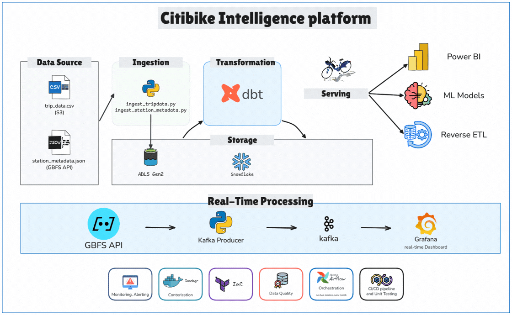
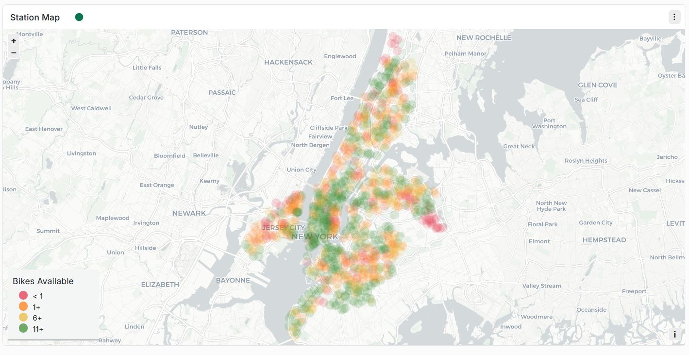

> ⚠️ Work in Progress - This project is under active development and not yet complete.

# Citibike Intelligence Platform
The Citibike Intelligence Platform is a comprehensive data engineering and analytics solution designed to process and analyze Citibike's trip and station data. The platform ingests both batch and real-time data, transforms it through a multi-layered architecture, and provides insights via dashboards and machine learning models.
## Project Overview

## Data Engineering

### Batch Data Pipeline
- Ingesting historical trip data from S3 -> Airflow DAGs -> dbt transformations -> Snowflake Data Warehouse
- Ingesting station metadata from GBFS API -> Airflow DAGs -> dbt transformations -> Snowflake Data Warehouse

### Streaming Data Pipeline
Source - Station Status (GBFS API) -> Python Producer -> Kafka Topic -> Real-time Grafana Dashboard

### Data Quality and Validation
Using a stage-gate approach to ensure data quality at each step of the pipeline:
1. **External Stage**: Raw data is ingested into a staging area (Bronze layer) without any transformations.
2. **Validation**: Data is validated for completeness, accuracy, and consistency. Any issues
are logged and alerted for manual review.
3. **Staging Stage**: Validated data is transformed and loaded into the Silver layer, where it is cleaned and enriched.
4. **Validation**: The Silver layer undergoes another round of validation to ensure data integrity
before being loaded into the **Gold layer** (data marts) for analytics and reporting.

Useing Elementary Data package for data quality checks in dbt:

### Observability, Monitoring and Alerting
### Unit Testing and CI/CD pipeline

## Data Analytics
### 1. Power BI Dashboards
### 2. Deep analytics with Jupyter Notebooks
### 3. Reverse ETL
## Machine Learning
Some ideas for future work:
- **Demand Forecasting**: Predict bike demand at each station for the next hour/day.
- **Anomaly Detection**: Identify unusual patterns in bike usage or station status.