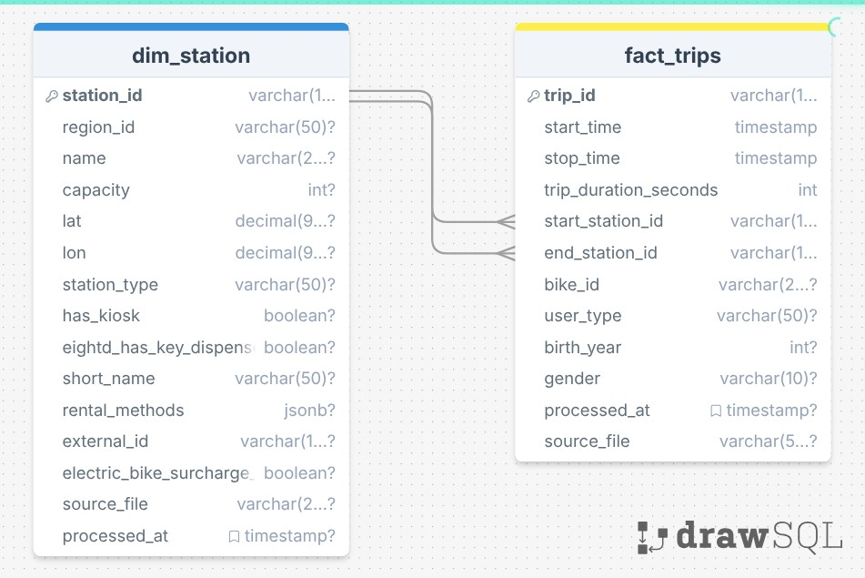

## Terraform
IaC will create the following resources in Azure and Snowflake:
### 🔵 Azure
- Resource Group
- ADLS Gen2 Storage Account
- Container (bronze)
### ❄️ Snowflake
- Warehouse (CITIBIKE_DWH)
- Database (CITIBIKE_DB)
- Schemas (EXTERNAL, SILVER, GOLD)
- 2 File Formats (CSV, JSON)
- An External Stage (BRONZE_STAGE)
- Storage Integration

## Data
1. **Batch** Data
- Trip Data
- Station Metadata
2. **Real-Time** Data
- Station Status (GBFS API)
3. External Data
- **Weather** Data
- Calendar / Events

## Data Modeling

- Trips Data -> fact_trips
    - birth_year removed in 2021 for privacy
    - gender removed in 2021 for privacy
- Station Metadata -> dim_station
    - Delete rental_uris
    - keep json as it is

## Airflow
- Ingest the trips data monthly start with 01-2021

### Data Flow:
1. Download CSV from Citibike S3
2. Validate file (size, columns, row count)
3. Upload to ADLS Bronze
4. Refresh Snowflake external table
5. Run dbt (Silver + Gold)
6. Run dbt tests
7. Data quality checks
8. Send alerts

## dbt
Stage-gate approach: external → validate → staging → validate → marts
### Tests
- shcema.yml for each model